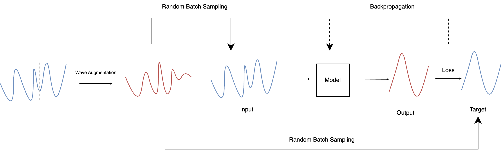
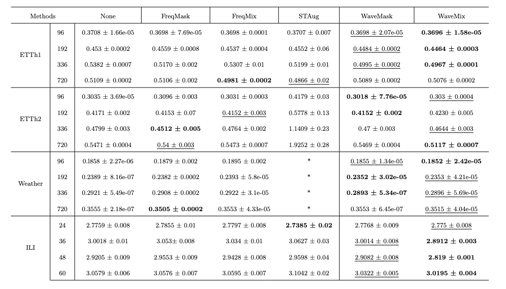
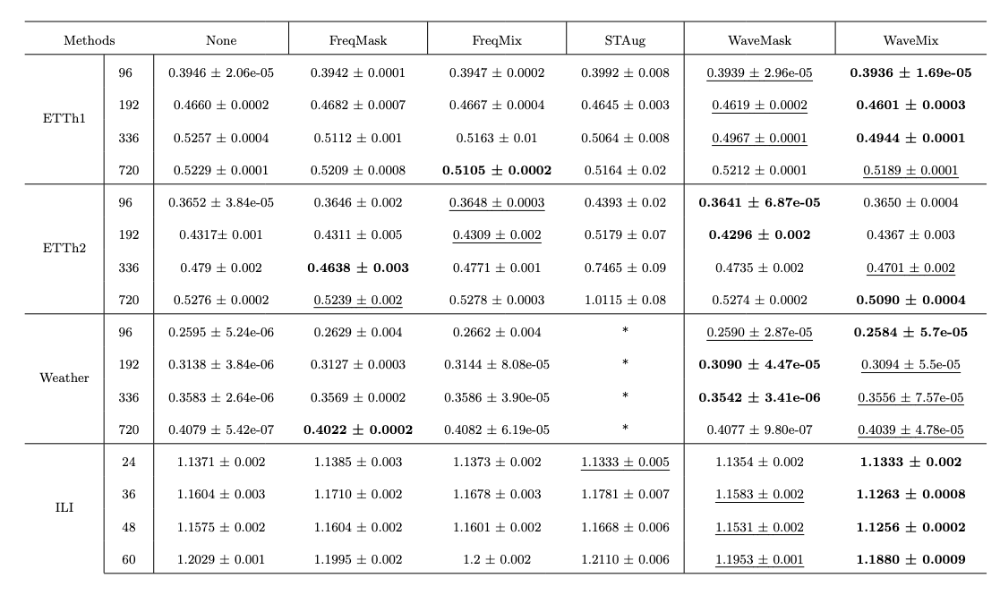

# WaveMask & WaveMix

The figure depicts a framework of the training stages incorporating wavelet augmentations, which involve the concatenation of
the look-back window and the forecasting horizon prior to transformation and augmentation. Batch sampling of the generated synthetic data is conducted according to a predefined hyperparameter called the sampling rate. These batches are subsequently used to split the data into the look-back window and target horizon, after which they are concatenated with the original data. Wavelet augmentations are Wavelet Masking (WaveMask) and Wavelet Mixing (WaveMix). These techniques utilize the discrete wavelet transform (DWT) to obtain wavelet coefficients (both approximation and detail coefficients) by breaking down the signal and adjusting these coefficients, in line with modifying frequency components across different time scales. 

WaveMask selectively eliminates specific wavelet coefficients at each decomposition level, thereby introducing variability in the augmented data. Conversely, WaveMix exchanges wavelet coefficients from two distinct instances of the dataset, thereby enhancing the diversity of the augmented data. 

To the best of our knowledge, this is the first study to conduct extensive experiments on multivariate time series using Discrete Wavelet Transform as an augmentation technique.


<div align=center>

</div>


Tables present comparisons between our methods and baselines in terms of the metrics Mean Squared Error (MSE) and Mean Absolute Error (MAE). The best result is indicated in bold, while the second most favorable outcome is underlined.

<div align=center>

</div>


<div align=center>

</div>


## Dataset

You can obtain all datasets under https://drive.google.com/drive/folders/1ZOYpTUa82_jCcxIdTmyr0LXQfvaM9vIy. All of them are ready for training. 

```
  mkdir dataset
```
Please place all of them within the ```./dataset ``` directory.

## Quick Start

Clone the project

```bash
  git clone https://github.com/jafarbakhshaliyev/Wave-Augs.git
```

Go to the project directory

```bash
  cd Wave-Augs
```

Install dependencies

```bash
  pip install -r requirements.txt
```

Train: 

```bash
  sh scripts/etth1.sh
  sh scripts/etth2.sh
  sh scripts/weather.sh
  sh scripts/ili.sh
```

You can change ```percentage``` to down-sample training dataset for ablation study.

## Citation

If you find the code useful, please cite our paper:

```
@misc{arabi2024wavemaskmixexploringwaveletbasedaugmentations,
      title={Wave-Mask/Mix: Exploring Wavelet-Based Augmentations for Time Series Forecasting}, 
      author={Dona Arabi and Jafar Bakhshaliyev and Ayse Coskuner and Kiran Madhusudhanan and Kami Serdar Uckardes},
      year={2024},
      eprint={2408.10951},
      archivePrefix={arXiv},
      primaryClass={cs.LG},
      url={https://arxiv.org/abs/2408.10951}, 
}
```

Please remember to cite all the datasets and compared methods if you use them in your experiments.

## Acknowledgements

We would like to express our gratitude to [Zheng et al.](https://arxiv.org/abs/2205.13504) for providing datasets used in this project. Additionally, we also acknowledge [Chen et al.](https://arxiv.org/abs/2302.09292) and [Zhang et al.](https://arxiv.org/abs/2303.14254)  for their code frameworks, which served as the foundation for our codebase.